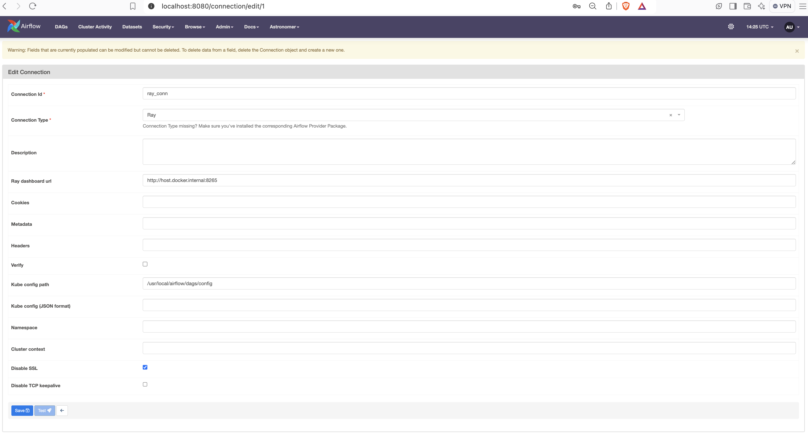

Setup RayCluster and Airflow
============================

This section describes the local setup for RayCluster and `Apache Airflow® <https://airflow.apache.org/>`_.

Prerequisites
-------------

Install the following software:

- Docker
- Enable Docker Desktop Kubernetes
- Kind
- Helm
- Kubectl
- Astro CLI

Setup RayCluster
----------------

For detailed instructions, refer to the official guide: `RayCluster Quick Start <https://docs.ray.io/en/latest/cluster/kubernetes/getting-started/raycluster-quick-start.html#raycluster-quickstart>`_.

1. **Create a Kind Cluster**

.. code-block:: bash

    kind create cluster --image=kindest/node:v1.26.0

2. **Deploy a KubeRay Operator**

.. code-block:: bash

    helm repo add kuberay https://ray-project.github.io/kuberay-helm/
    helm repo update

    # Install both CRDs and KubeRay operator v1.2.2.
    helm install kuberay-operator kuberay/kuberay-operator --version 1.2.2

    # Confirm that the operator is running in the namespace `default`.
    kubectl get pods
    # NAME                                READY   STATUS    RESTARTS   AGE
    # kuberay-operator-b498fcfdf-hsjvk    1/1     Running   0          29s

3. **Deploy a RayCluster Custom Resource**

.. code-block:: bash

    # Deploy a sample RayCluster CR from the KubeRay Helm chart repo:
    helm install raycluster kuberay/ray-cluster --version 1.2.2 --set 'image.tag=2.9.0-aarch64'

    # Once the RayCluster CR has been created, you can view it by running:
    kubectl get rayclusters
    # NAME                 DESIRED WORKERS   AVAILABLE WORKERS   CPUS   MEMORY   GPUS   STATUS   AGE
    # raycluster-kuberay   1                 1                   2      3G       0      ready    99s

    # View the pods in the RayCluster named "raycluster-kuberay"
    kubectl get pods --selector=ray.io/cluster=raycluster-kuberay

    # NAME                                          READY   STATUS    RESTARTS   AGE
    # raycluster-kuberay-head-wvzh2                 1/1     Running   0          XXs
    # raycluster-kuberay-worker-workergroup-4dfsb   1/1     Running   0          XXs

Wait for the pods to reach the Running state

4. Expose the Port on Host Machine

.. code-block:: bash

    kubectl get service raycluster-kuberay-head-svc

    # NAME                          TYPE        CLUSTER-IP    EXTERNAL-IP   PORT(S)                                         AGE
    # raycluster-kuberay-head-svc   ClusterIP   10.96.1.92    <none>        8265/TCP,8080/TCP,8000/TCP,10001/TCP,6379/TCP   25m

    # Execute this in a separate shell.
    kubectl port-forward service/raycluster-kuberay-head-svc 8265:8265

5. Access the Ray Dashboard

Visit http://127.0.0.1:8265 in your browser

Setup Apache Airflow®
----------------------

1. Start Airflow Instance

.. code-block:: bash

    make docker-run

2. Create Airflow Connection

a. Visit http://localhost:8080/ in your browser.
b. Log in with username: admin and password: admin.
c. Click on Admin -> Connections -> Add a new record. Select Connection type ``Ray``

The most basic setup will look something like below:

