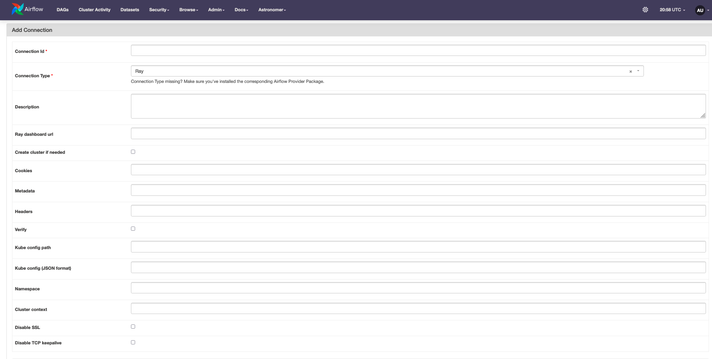

Getting Started
===============

**1. Install Helm:**

.. code-block:: sh

   curl -fsSL -o get_helm.sh https://raw.githubusercontent.com/helm/helm/main/scripts/get-helm-3
   chmod 700 get_helm.sh
   ./get_helm.sh

See the `installing Helm <https://helm.sh/docs/intro/install/>`_ page for other options.

.. note::
   This step is only required if you do not have a ray cluster and intend to spin it up using the provider.

**2. Install the python package:**

.. code-block:: sh

   pip install astro-provider-ray

**3. Setting up the Airflow connection**

- Setup/Teardown a Ray cluster on Kubernetes

   - **Connection ID**: e.g., "ray_k8s_conn"
   - **Connection Type**: "Ray"
   - **Kube config path** OR **Kube config content (JSON format)**: Kubeconfig of the Kubernetes cluster where Ray cluster must be set up
   - **Namespace**: The K8s namespace where your cluster must be created. If not provided, "default" is used
   - **Optional fields**: Cluster context, Disable SSL, Disable TCP keepalive

- Use an existing Ray cluster

   - **Connection ID**: e.g., "ray_conn"
   - **Connection Type**: "Ray"
   - **Ray dashboard URL**: URL of the Ray dashboard
   - **Optional fields**: Cookies, Metadata, Headers, Verify SSL

