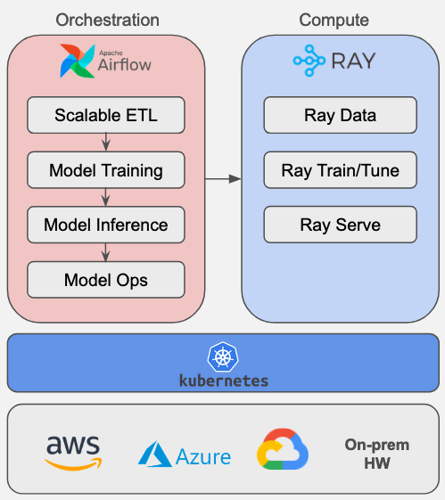

Welcome to astro-provider-ray documentation!
===================================================

.. toctree::
   :hidden:
   :maxdepth: 1
   :caption: Contents:

   Home <self>
   Getting started <getting_started/setup>
   Code Samples <getting_started/code_samples>
   API Reference <api/ray_provider>
   Contributing <CONTRIBUTING>

This repository provides tools for integrating `Apache Airflow®`_ with Ray, enabling the orchestration of Ray jobs within Airflow DAGs. It includes a decorator, two operators, and one trigger designed to efficiently manage and monitor Ray jobs and services.

Benefits of using this provider include:

- **Integration**: Incorporate Ray jobs into Airflow DAGs for unified workflow management.
- **Distributed computing**: Use Ray's distributed capabilities within Airflow pipelines for scalable ETL, LLM fine-tuning etc.
- **Monitoring**: Track Ray job progress through Airflow's user interface.
- **Dependency management**: Define and manage dependencies between Ray jobs and other tasks in DAGs.
- **Resource allocation**: Run Ray jobs alongside other task types within a single pipeline.

.. _Apache Airflow®: https://airflow.apache.org/

Table of Contents
-----------------

- `What is the Ray provider?`_
- `Components`_
- `Contact the Devs`_
- `Changelog`_
- `Contributing Guide`_

What is the Ray provider?
-------------------------

Enterprise data value extraction involves two crucial components:

- Data Engineering
- Data Science/ML/AI

While Airflow excels at data engineering tasks through its extensive plugin ecosystem, it generally relies on external systems when dealing with large-scale ETL(100s GB to PB scale) or AI tasks such as fine-tuning & deploying LLMs etc.

Ray is a particularly powerful platform for handling large scale computations and this provider makes it very straightforward to orchestrate Ray jobs from Airflow.

The architecture diagram above shows how we can deploy both Airflow & Ray on a Kubernetes cluster for elastic compute.

Use Cases
^^^^^^^^
- **Scalable ETL**: Orchestrate and monitor Ray jobs on on-demand compute clusters using the Ray Data library. These operations could be custom Python code or ML model inference.
- **Model Training**: Schedule model training or fine-tuning jobs on flexible cadences (daily/weekly/monthly). Benefits include:

  * Optimize resource utilization by scheduling Ray jobs during cost-effective periods
  * Trigger model refresh based on changing business conditions or data trends

- **Model Inference**: Inference of trained or fine-tuned models can be handled in two ways:

  * **Batch Inference** jobs can be incorporated into Airflow DAGs for unified workflow management and monitoring
  * **Real time** models (or online models) that use Ray Serve can be deployed using the same operators with ``wait_for_completion=False``

- **Model Ops**: Leverage Airflow tasks following Ray job tasks for model management

  * Deploy models to a model registry
  * Perform champion-challenger analysis
  * Execute other model lifecycle management tasks

Components
----------

Hooks
^^^^^
- **RayHook**: Sets up methods needed to run operators and decorators, working with the 'Ray' connection type to manage Ray clusters and submit jobs.

Decorators
^^^^^^^^^^
- **_RayDecoratedOperator**: Simplifies integration by decorating task functions to work seamlessly with Ray.

Operators
^^^^^^^^^
- **SetupRayCluster**: Sets up or Updates a ray cluster on kubernetes using a kubeconfig input provided through the Ray connection
- **DeleteRayCluster**: Deletes and existing Ray cluster on kubernetes using the same Ray connection
- **SubmitRayJob**: Submits jobs to a Ray cluster using a specified host name and monitors its execution

Triggers
^^^^^^^^
- **RayJobTrigger**: Monitors asynchronous job execution submitted via ``SubmitRayJob`` or using the ``@task.ray()`` decorator and prints real-time logs to the the Airflow UI

Contact the devs
----------------

If you have any questions, issues, or feedback regarding the astro-provider-ray package, please don't hesitate to reach out to the development team. You can contact us through the following channels:

- **GitHub Issues**: For bug reports, feature requests, or general questions, please open an issue on our `GitHub repository`_.
- **Slack Channel**: Join Apache Airflow's `Slack <https://join.slack.com/t/apache-airflow/shared_invite/zt-2nsw28cw1-Lw4qCS0fgme4UI_vWRrwEQ>`_. Visit ``#airflow-ray`` for discussions and help.

We appreciate your input and are committed to improving this package to better serve the community.

.. _GitHub repository: https://github.com/astronomer/astro-provider-ray/issues
.. _#airflow-ray: https://astronomer-community.slack.com/archives/C01234567

Changelog
---------

We follow `Semantic Versioning`_ for releases.
Check `CHANGELOG.rst`_ for the latest changes.

.. _Semantic Versioning: https://semver.org/
.. _CHANGELOG.rst: https://github.com/astronomer/astro-provider-ray/blob/main/CHANGELOG.rst

Contributing Guide
------------------

All contributions, bug reports, bug fixes, documentation improvements, enhancements are welcome.

A detailed overview an how to contribute can be found in the `Contributing Guide`_

.. _Contributing Guide: https://github.com/astronomer/astro-provider-ray/blob/main/docs/CONTRIBUTING.rst
